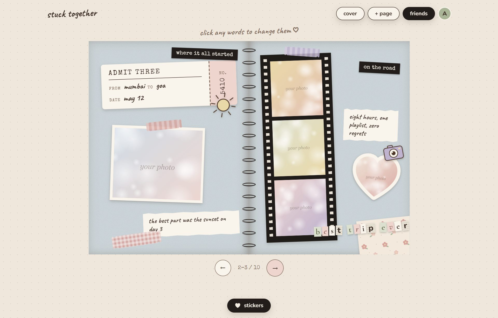
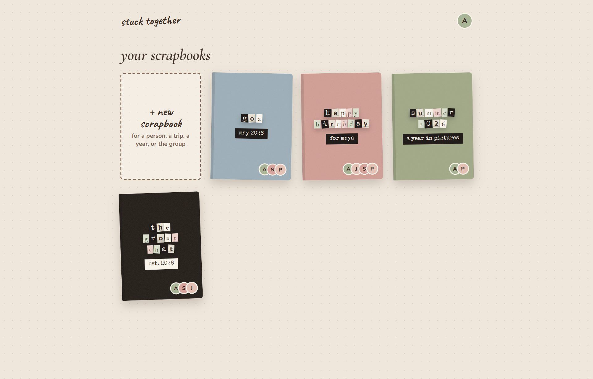
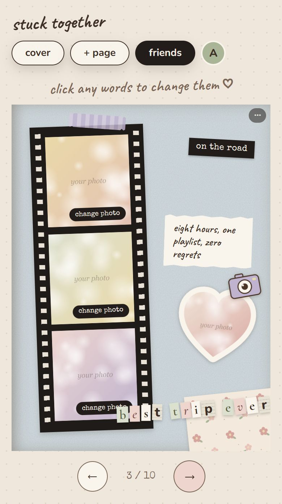
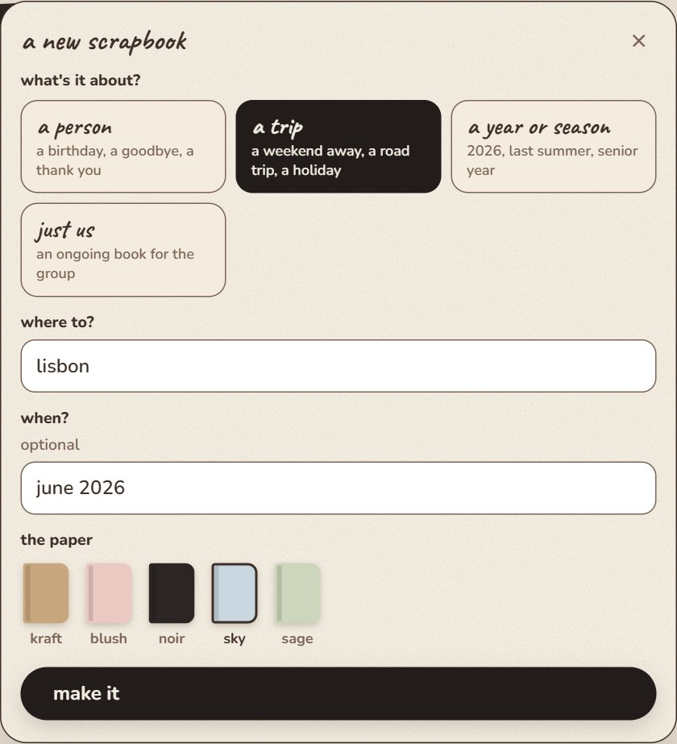
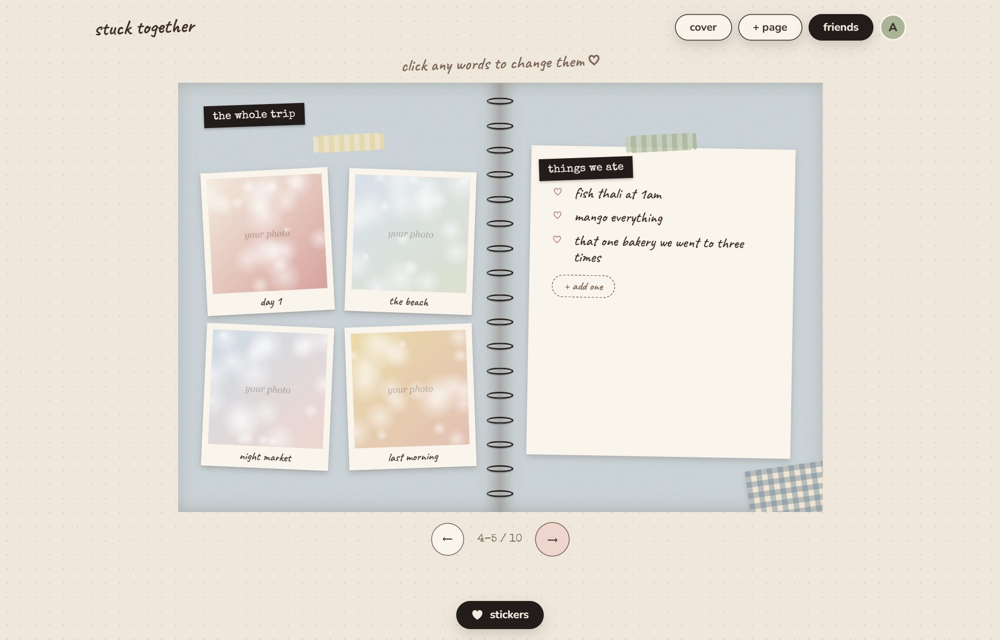
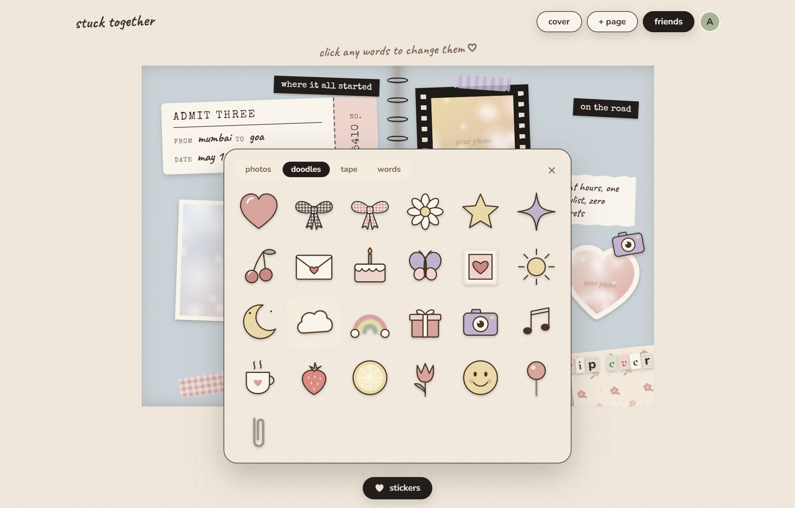
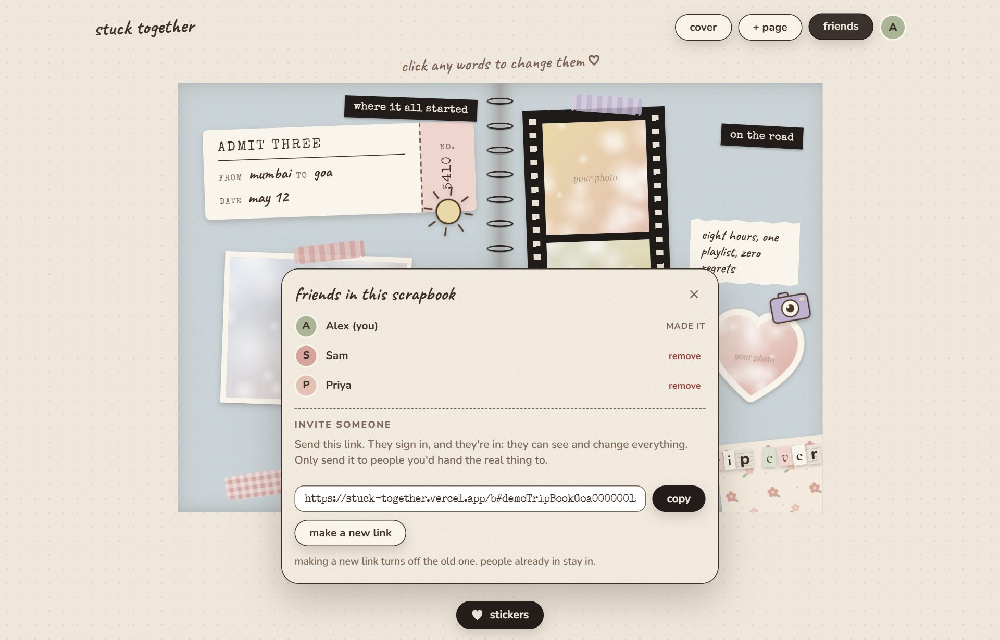

# stuck together 🎀

Flippable scrapbooks you make with your friends. Start one for someone's birthday, a
trip, a whole year, or just the group, send the invite link to the group chat, and fill
it together with photos, letters, lists and stickers. Everyone sees each other's changes
live.

### → [stuck-together.vercel.app](https://stuck-together.vercel.app)

<table>
  <tr>
    <td width="62%"></td>
    <td width="38%"></td>
  </tr>
  <tr>
    <td align="center">your shelf</td>
    <td align="center">on a phone, one page at a time</td>
  </tr>
</table>

*The screenshots use sample books and placeholder images.*

## 1. Start a scrapbook

Sign in with Google, or get a sign-in link by email (no passwords). Then tap
**+ new scrapbook** and pick what it's about:

- **a person:** a birthday, a goodbye, a thank you
- **a trip:** a weekend away, a road trip, a holiday
- **a year or season:** 2026, last summer, senior year
- **just us:** an ongoing book for the group

Each one starts with its own pages. Pick a paper: kraft, blush, noir, sky or sage.

## 2. Fill it in

- **Words:** click any text and type.
- **Photos:** tap **add photo** on any frame.
- **Pages:** **+ page** adds a letter, one photo, two photos with a newspaper clipping,
  a collage, a film strip, a photo grid, a ticket stub, a list, a notes wall, a quote,
  or a blank page.
- **Flip** by dragging a page corner, or with the arrows.

## 3. Decorate

Tap **stickers**. Every photo in the book can be cut into a heart, circle, scallop, star
or square. There are also doodles, washi tape, and word stickers in typewriter, tape or
cut-out letters. Drag them anywhere, then tilt, resize or peel them off.

## 4. Invite your friends

Tap **friends**, copy the invite link, and send it to the group. They sign in and
they're in.

## Who can see a scrapbook

- Only the people in it. Nobody can browse or search other people's scrapbooks.
- Anyone with the invite link can join and change everything, so only send it to people
  you'd hand the real thing to.
- **make a new link** turns off the old one. People already in stay in.
- The person who made a scrapbook can remove people or delete it. Anyone else can leave.
- Photos are shrunk before they're uploaded, so they look great in the book but aren't
  full resolution. Keep your originals.

## Credits

Page turning by [StPageFlip](https://github.com/Nodlik/StPageFlip) (MIT, see
`public/vendor/page-flip-LICENSE`).
